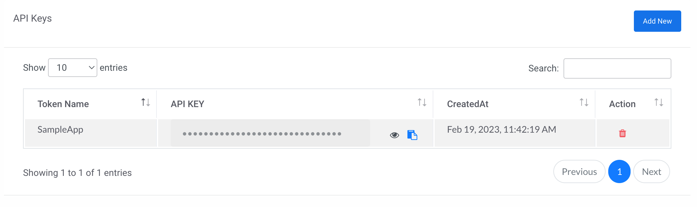

API Keys authentication (also known as token authentication) is the authentication method used by Signalmash APIs. Signalmash supports standard token authentication methods for installed, client-side, web server, and mobile applications.

### Basic Authentication Steps

#### 1. Obtain API token credentials from Signalmash Portal.

To get token credentials, such as a **API KEY** that are known to both Signalmash and your application, go to the Signalmash Portal (go to the API Menu and select "[Tokens](https://portal.signalmash.com/#/api/tokens)" from the submenu).



#### 2. Include the API KEY in header when requesting to an API endpoints.

For endpoints authentication, you will use your Signalmash API KEY as your Authorization token.




```bash
curl --location 'https://api.signalmash.com/campaigns' \
--header 'Authorization: API_KEY'
```




```python
import http.client

conn = http.client.HTTPSConnection("api.signalmash.com")
payload = ''
headers = {
  'Authorization': 'API_KEY'
}
conn.request("GET", "/campaigns", payload, headers)
res = conn.getresponse()
data = res.read()
print(data.decode("utf-8"))
```




```golang
package main

import (
  "fmt"
  "net/http"
  "io/ioutil"
)

func main() {

  url := "https://api.signalmash.com/campaigns"
  method := "GET"

  client := &http.Client {
  }
  req, err := http.NewRequest(method, url, nil)

  if err != nil {
    fmt.Println(err)
    return
  }
  req.Header.Add("Authorization", "API_KEY")

  res, err := client.Do(req)
  if err != nil {
    fmt.Println(err)
    return
  }
  defer res.Body.Close()

  body, err := ioutil.ReadAll(res.Body)
  if err != nil {
    fmt.Println(err)
    return
  }
  fmt.Println(string(body))
}
```





```php
<?php

$curl = curl_init();

curl_setopt_array($curl, array(
  CURLOPT_URL => 'https://api.signalmash.com/campaigns',
  CURLOPT_RETURNTRANSFER => true,
  CURLOPT_ENCODING => '',
  CURLOPT_MAXREDIRS => 10,
  CURLOPT_TIMEOUT => 0,
  CURLOPT_FOLLOWLOCATION => true,
  CURLOPT_HTTP_VERSION => CURL_HTTP_VERSION_1_1,
  CURLOPT_CUSTOMREQUEST => 'GET',
  CURLOPT_HTTPHEADER => array(
    'Authorization: API_KEY'
  ),
));

$response = curl_exec($curl);

curl_close($curl);
echo $response;
```





```http
GET /campaigns HTTP/1.1
Host: api.signalmash.com
Authorization: API_KEY
```




```json
# Response
{
    "data": [],
    "message": "Campaign Fetched Successfully!",
    "status": 200
}
```

### Revoking API Token

An application's access may occasionally be revoked by a user. By visiting Signalmash Portal, selecting "[Tokens](https://portal.signalmash.com/#/api/tokens)" from the submenu, and clicking the delete icon, a user can revoke access.
